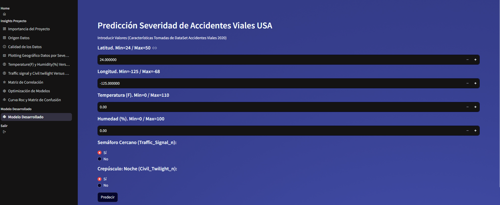
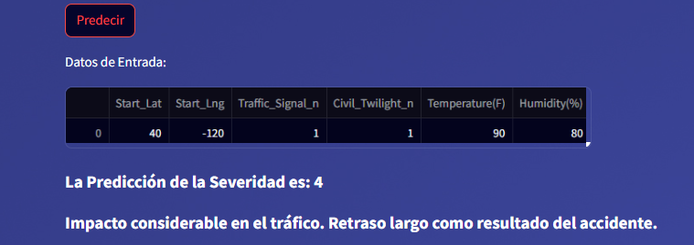
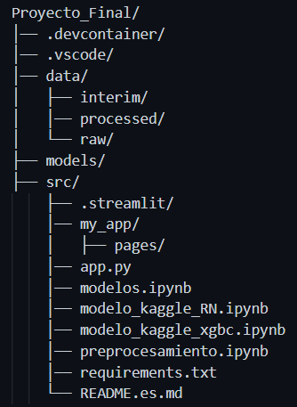

## Diseño de un Modelo Machine Learning para predecir la Severidad de los Accidentes en Estados Unidos. 

## Descripción. El conjunto de datos representa los accidentes automovilísticos de alcance nacional que cubre 49 estados de los EE. UU. Los datos de accidentes se recopilaron desde febrero de 2016 hasta marzo de 2023, utilizando múltiples API que proporcionan datos de incidentes (o eventos) de tráfico en tiempo real. Estas API transmiten datos de tráfico capturados por varias entidades, incluidos los departamentos de transporte de los EE. UU. y los estados, las agencias de aplicación de la ley, las cámaras de tráfico y los sensores de tráfico dentro de las redes de carreteras. El conjunto de datos contiene actualmente aproximadamente 7,7 millones de registros de accidentes. **Para efectos de este estudio solo se trabajará con la data correspondiente al año 2020**. El modelo a considerar consiste en predecir la severidad en los accidentes. En el DataSet existe una variable multiclase (1,2,3,4) llamada Severity, que describe la gravedad del accidente, esta sería el objetivo o target a predecir, por lo cual, el **modelo sería de clasificación tipo multiclase**.

## Importancia del Modelo. Este modelo de machine learning puede permitir a los servicios de emergencia priorizar y asignar recursos de manera más eficiente. Si se predice que un accidente es de alta severidad, se puede enviar ayuda médica y de rescate más rápidamente. En relación a la gestión del tráfico, las autoridades pueden tomar decisiones informadas para desviar el tráfico y evitar congestiones adicionales. Esto es crucial para minimizar el impacto en la red vial y reducir el riesgo de accidentes secundarios.

    - Severidad 1: Indica el menor impacto en el tráfico, es decir, un retraso corto como resultado del accidente.

    - Severidad 2: Impacto moderado en el tráfico.

    - Severidad 3: Impacto significativo en el tráfico.

    - Severidad 4: Indica un impacto considerable en el tráfico, es decir, un retraso largo como resultado del accidente.

## Instalación

### Requisitos previos
- Python 3.x
- Librerías necesarias (`numpy`, `pandas`, `scikit-learn`,`streamlit`,`streamlit-option-menu`,`joblib`, entre otros).
### Instrucciones de instalación
1. Clona el repositorio:
   ```bash
   git clone https://github.com/Gfotero/Proyecto_Final.git
   ```

Instalar las dependencias:
pip install -r requirements.txt

### Uso
desde ../Proyecto_Final/src ejecutar desde el terminal > streamlit run app.py , escoger la opción Modelo Desarrollado e introducir los valores de las características: Latitud, Longitud, Temperatura (F), Humedad (%), Semáforo Cercano (Si o No), Crepúsculo: Noche (Si o No). 

### Entrada de Datos

### Capturas de pantalla


### Salida del Modelo




## Estructura del Proyecto



- app.py . Aplicación principal usada con streamlit y render para el despliegue del modelo.
- preprocesamiento.ipynb. Carga de data, realización de EDA y generación de los conjuntos Train y Test.
- modelos.ipynb. Entrenamiento y evaluación de los distintos modelos utilizados en el proyecto.
- modelo_kaggle_RN.ipynb. Entrenamiento y evaluación de modelos de Redes Neuronales en Kaggle.
- modelo_kaggle_xgbc.ipynb. Entrenamiento y evaluación modelo Xg-Boosting en Kaggle.

## Licencia
Este proyecto es de código abierto (Open Source) y de libre uso.

## Enlace de la Aplicación en Render
https://proyecto-final-9wyg.onrender.com

## Referencias

Documentación de scikit-learn, streamlit y render.

