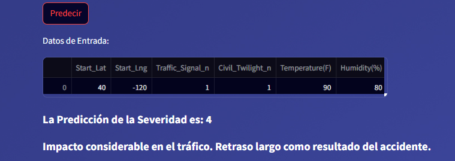
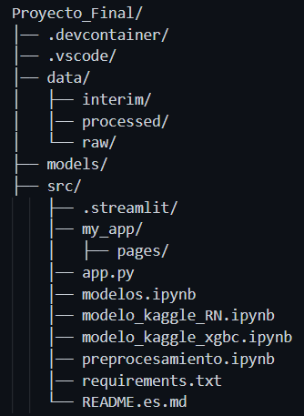

## Designing a Machine Learning Model to Predict Accident Severity in the United States.

## Description. The dataset represents nationwide car accidents covering 49 states in the US. Accident data was collected from February 2016 to March 2023, using multiple APIs that provide real-time traffic incident (or event) data. These APIs stream traffic data captured by multiple entities including US and state departments of transportation, law enforcement agencies, traffic cameras, and traffic sensors within road networks. The dataset currently contains approximately 7.7 million accident records. **For the purposes of this study, only data from the year 2020 will be used**. The model to be considered is to predict the severity of accidents. In the DataSet there is a multiclass variable (1,2,3,4) called Severity, which describes the severity of the accident, this would be the target to predict, therefore, the **model would be a multiclass classification model**.

## Importance of the Model. This machine learning model can allow emergency services to prioritize and allocate resources more efficiently. If an accident is predicted to be of high severity, medical and rescue help can be sent more quickly. In relation to traffic management, authorities can make informed decisions to divert traffic and avoid additional congestion. This is crucial to minimize the impact on the road network and reduce the risk of secondary accidents.

- Severity 1: Indicates the least impact on traffic, i.e. a short delay as a result of the accident.

- Severity 2: Moderate impact on traffic.

- Severity 3: Significant impact on traffic.

- Severity 4: Indicates a considerable impact on traffic, i.e. a long delay as a result of the accident.

## Installation

### Prerequisites
- Python 3.x
- Required libraries (`numpy`, `pandas`, `scikit-learn`,`streamlit`,`streamlit-option-menu`,`joblib`, among others).
### Installation instructions
1. Clone the repository:
```bash
   git clone https://github.com/Gfotero/Proyecto_Final.git
   ```
Install dependencies:
pip install -r requirements.txt

### Usage
from ../Final_Project/src run from the terminal > streamlit run app.py , choose the Developed Model option and enter the values ​​for the characteristics: Latitude, Longitude, Temperature (F), Humidity (%), Nearby Traffic Light (Yes or No), Twilight: Night (Yes or No).

### Data entry

### Screenshots


### Model Output



## Project Structure



- app.py . Main application used with streamlit and render for model deployment.
- preprocessing.ipynb. Data loading, EDA performance and generation of Train and Test sets.
- models.ipynb. Training and evaluation of the different models used in the project.
- model_kaggle_RN.ipynb. Training and evaluation of Neural Network models in Kaggle.
- model_kaggle_xgbc.ipynb. Training and evaluation of Xg-Boosting model in Kaggle.

## License
This project is open source and free to use.

## References
Documentation for scikit-learn, streamlit and render.